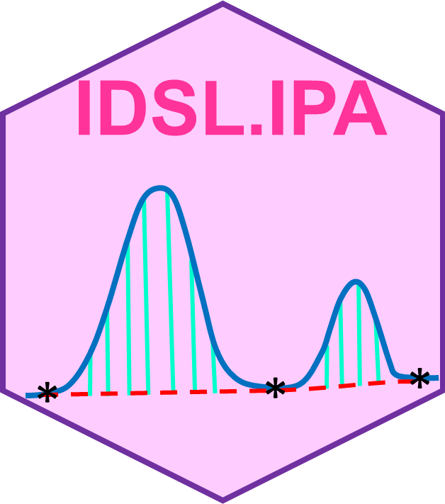
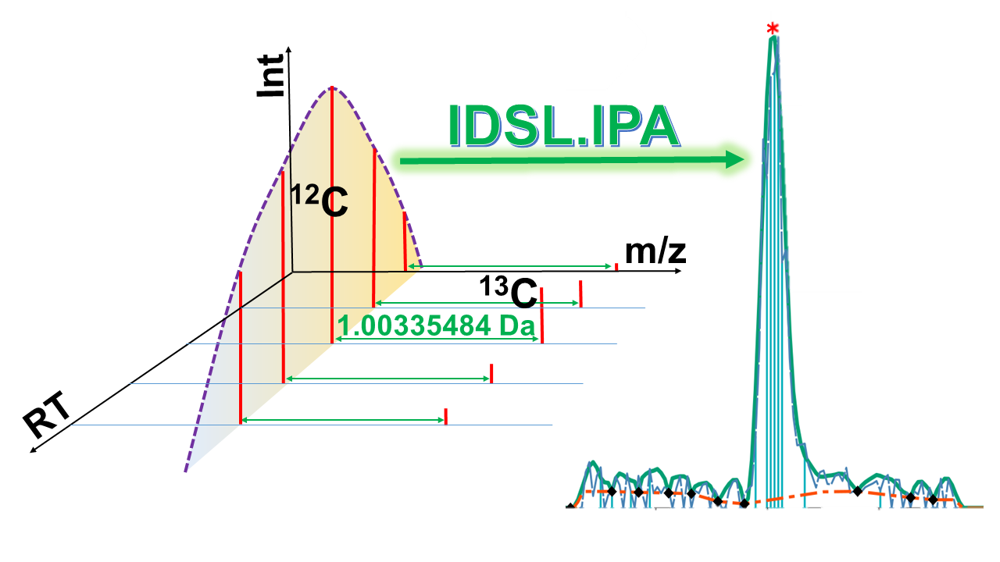

# IDSL.IPA

<!-- badges: start -->

<!-- badges: end -->

**Intrinsic Peak Analysis (IPA)** by the [**Integrated Data Science Laboratory for Metabolomics and Exposomics (IDSL.ME)**](https://www.idsl.me) is a light-weight R package that extracts peaks for organic small molecules from untargeted liquid chromatography high resolution mass spectrometry (LC/HRMS) data in population scale projects. IDSL-IPA generates comprehensive and high-quality datasets from untargeted analysis of organic small molecules in a bio-specimen. It is a suite of new algorithms covering extracted ion chromatogram (EIC) candidate generation, peak detection, peak property evaluation, mass-correction, retention time correction across multiple batches and peak annotation. IDSL.IPA has been optimized and tested for analysis of large sample sizes (n = 499) samples. We have shown that IDSL.IPA in our [publication](https://github.com/idslme/IDSL.IPA#citation) is able to outperform similar peak picking tools such as MZmine 2, *xcms*, and MS-DIAL in terms of sensitivity, specificity and speed.

## 

## Table of Contents

- [Features of IDSL.IPA](https://github.com/idslme/IDSL.IPA#features-of-idslipa)
- [Installation](https://github.com/idslme/IDSL.IPA#installation)
- [Workflow](https://github.com/idslme/IDSL.IPA#workflow)
- [Quick Batch Example](https://github.com/idslme/IDSL.IPA#quick-batch-example)
- [Wiki](https://github.com/idslme/IDSL.IPA#wiki)
- [News and Updates](https://github.com/idslme/IDSL.IPA#news-and-updates)
- [Citation](https://github.com/idslme/IDSL.IPA#citation)

## Features of IDSL.IPA

1) Parameter selection through a well-described [parameter spreadsheet](https://raw.githubusercontent.com/idslme/IDSL.IPA/main/IPA_parameters.xlsx)
2) Process high-throughput and population size studies (n > 500)
3) Calculating 17 chromatographic peak properties
4) Mass spectra level [Ion Pairing](https://github.com/idslme/IDSL.IPA/wiki/Ion-Pairing) to remove random noises to accelerate the processing speed
5) Compatibility to screen for any ion mass difference in addition to natural carbon signatures (12C/13C isotopologues) mass difference
6) [Retention time correction](https://github.com/idslme/IDSL.IPA/wiki/Retention-Index) using endogenous reference markers
7) Generating batch untargeted extracted ion chromatograms (EICs)
8) Generating pairwise correlations list for aligned peak height and its gap-filled tables to detect potential recurring adducts, in-source products and fragment peaks
9) Aggregating untargeted EICs after (m/z-RT) annotation for each compound
10) Compatibility with parallel processing in Windows and Linux environments
11) Compatibility with downstream molecular formula annotation tools such as [IDSL.UFA](https://github.com/idslme/IDSL.UFA) and [IDSL.UFAx](https://github.com/idslme/IDSL.UFAx)
12) Compatibility with [IDSL.CSA](https://github.com/idslme/IDSL.CSA) workflow to cluster recurring ions to generate composite spectra

## Installation

	install.packages("IDSL.IPA")
	
**Note:** In case you want to process **netCDF/CDF** mass spectrometry data by IDSL.IPA, you should also install the [**RnetCDF**](https://CRAN.R-project.org/package=RNetCDF) package separately using the below command.

	install.packages("RNetCDF")

## Workflow

To process your mass spectrometry data (**mzXML**, **mzML**, **netCDF**), download the [IPA parameter spreadsheet](https://raw.githubusercontent.com/idslme/IDSL.IPA/main/IPA_parameters.xlsx) and select the parameters accordingly and then use this spreadsheet as the input for the `IPA_workflow` function as shown below:

	library(IDSL.IPA)
	IPA_workflow("Address of the IPA parameter spreadsheet")

## Quick Batch Example

Follow these steps for a quick case study (n=33) [ST002263](https://www.metabolomicsworkbench.org/data/DRCCMetadata.php?Mode=Study&StudyID=ST002263&DataMode=AllData&ResultType=1) which has Thermo Q Exactive HF hybrid Orbitrap data collected in the HILIC-ESI-POS/NEG modes. 

1. Download [ST002263_Rawdata.zip (1.6G)](https://www.metabolomicsworkbench.org/data/DRCCStudySummary.php?Mode=SetupRawDataDownload&StudyID=ST002263)

2. Separate positive and negative modes *.mzXML* data in different folders. We generally suggest processing positive and negative modes data separately to avoid data similarity complications.

3. IDSL.IPA requires 51 parameters distributed into 9 separate sections. For this study, use default parameter values presented in the [IPA parameter spreadsheet](https://raw.githubusercontent.com/idslme/IDSL.IPA/main/IPA_parameters.xlsx). Next, Provide address for 
	
	3.1. **PARAM0007** for the *Input data location address (MS1 level HRMS data)*
	
	3.2. **PARAM0010** for *Output location address (MS1 processed data)*
		
	3.3. You may also increase the number of processing threads using **PARAM0006** according to your computational power

4. Run this command in R/Rstudio console or terminal: `IDSL.IPA::IPA_workflow("Address of the IPA parameter spreadsheet")`

5. You may parse the results at the address you provided for **PARAM0010**.

## [**Wiki**](https://github.com/idslme/IDSL.IPA/wiki)

1. [**Example of a population size study with 499 indivdual mass spectrometry file**](https://github.com/idslme/IDSL.IPA/wiki/IDSL.IPA-for-MTBLS1684-study)
2. `IPA_targeted` function for a large number of peaks (***m/z***-**RT** pairs) with an [**example for targeted IDSL.IPA**](https://github.com/idslme/IDSL.IPA/wiki/IPA_targeted)
3. [**Ion Pairing**](https://github.com/idslme/IDSL.IPA/wiki/Ion-Pairing)
4. [**Definition of Signal to Noise ratio (S/N)**](https://github.com/idslme/IDSL.IPA/wiki/Definition-Signal-to-Noise-Ratio)
5. [**nIsoPair/RCS**](https://github.com/idslme/IDSL.IPA/wiki/nIsoPair-RCS)
6. [**Ratio of peak width at half-height to peak width at the baseline (RPW)**](https://github.com/idslme/IDSL.IPA/wiki/RPW)
7. [**Chromatogram gap percentage**](https://github.com/idslme/IDSL.IPA/wiki/Chromatogram-gaps-percentage-(missing-scans))
8. [**Peak tailing fronting resolving method**](https://github.com/idslme/IDSL.IPA/wiki/Peak-tailing-fronting-resolving)
9. [**Peak smoothing**](https://github.com/idslme/IDSL.IPA/wiki/Peak-smoothing)
10. [**Extra scans**](https://github.com/idslme/IDSL.IPA/wiki/Extra-scans)
11. [**Retention time correction**](https://github.com/idslme/IDSL.IPA/wiki/Retention-Index).

## News and Updates

We post major changes in the IDSL.IPA workflow [here](https://github.com/idslme/IDSL.IPA/blob/main/UPDATE.md).

## Citation

Fakouri Baygi, S., Kumar, Y. Barupal, D.K. [IDSL. IPA characterizes the organic chemical space in untargeted LC/HRMS datasets](https://pubs.acs.org/doi/10.1021/acs.jproteome.2c00120). *Journal of proteome research*, **2022**, *21(6)*, 1485-1494.