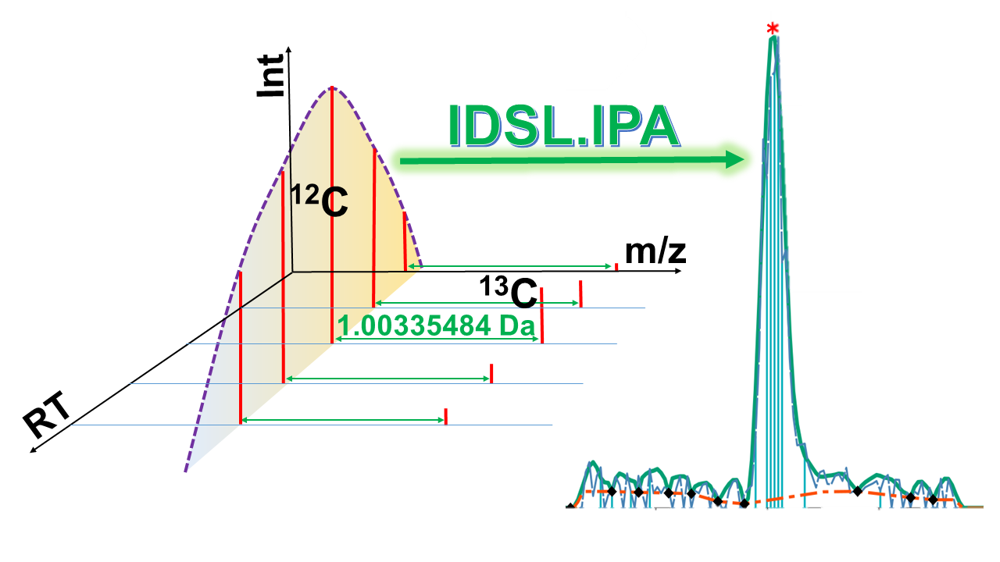

# IDSL.IPA 

<!-- badges: start -->

<!-- badges: end -->

Intrinsic Peak Analysis (IPA) by the Integrated Data Science Laboratory for Metabolomics and Exposomics (IDSL.ME) is an R pipeline that extracts peaks for organic small molecules from untargeted LC/HRMS data in population scale projects. 

Visit https://ipa.idsl.me/ for the detailed documentation and tutorial.